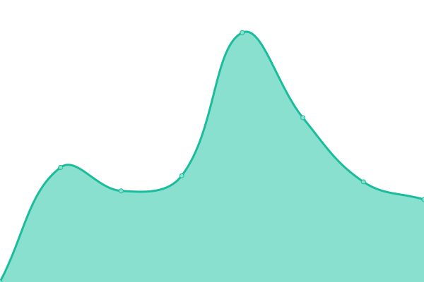

# [📈 Live Status](https://musinsa-sejong.github.io/uptime-sample): <!--live status--> **🟧 Partial outage**

This repository contains the open-source uptime monitor and status page for [musinsa-sejong](https://musinsa-sejong.github.io/uptime-sample), powered by [Upptime](https://github.com/upptime/upptime).

With [Upptime](https://upptime.js.org), you can get your own unlimited and free uptime monitor and status page, powered entirely by a GitHub repository. We use [Issues](https://github.com/musinsa-sejong/uptime-sample/issues) as incident reports, [Actions](https://github.com/musinsa-sejong/uptime-sample/actions) as uptime monitors, and [Pages](https://musinsa-sejong.github.io/uptime-sample) for the status page.

<!--start: status pages-->
<!-- This summary is generated by Upptime (https://github.com/upptime/upptime) -->
<!-- Do not edit this manually, your changes will be overwritten -->
<!-- prettier-ignore -->
| URL | Status | History | Response Time | Uptime |
| --- | ------ | ------- | ------------- | ------ |
|  [musinsa](https://www.musinsa.com) | 🟩 Up | [musinsa.yml](https://github.com/musinsa-sejong/musinsa-sejong.github.io/commits/HEAD/history/musinsa.yml) | 

 1981ms
     
 | 

<a href="https://musinsa-sejong.github.io/history/musinsa">100.00%</a>
    

|  [musinsa_ranking](https://www.musinsa.com/ranking/best) | 🟩 Up | [musinsa-ranking.yml](https://github.com/musinsa-sejong/musinsa-sejong.github.io/commits/HEAD/history/musinsa-ranking.yml) | 

 1601ms
     
 | 

<a href="https://musinsa-sejong.github.io/history/musinsa-ranking">100.00%</a>
    

|  [musinsa_search](https://www.musinsa.com/search/musinsa/integration?q=%EB%B0%98%ED%8C%94&type=popular) | 🟩 Up | [musinsa-search.yml](https://github.com/musinsa-sejong/musinsa-sejong.github.io/commits/HEAD/history/musinsa-search.yml) | 

 1013ms
     
 | 

<a href="https://musinsa-sejong.github.io/history/musinsa-search">100.00%</a>
    

|  [google](https://www.google.com) | 🟩 Up | [google.yml](https://github.com/musinsa-sejong/musinsa-sejong.github.io/commits/HEAD/history/google.yml) | 

 148ms
     
 | 

<a href="https://musinsa-sejong.github.io/history/google">100.00%</a>
    

|  [Test Broken Site](https://thissitedoesnotexist.koj.co) | 🟥 Down | [test-broken-site.yml](https://github.com/musinsa-sejong/musinsa-sejong.github.io/commits/HEAD/history/test-broken-site.yml) | 

 0ms
     
 | 

<a href="https://musinsa-sejong.github.io/history/test-broken-site">0.00%</a>
    

<!--end: status pages-->

[**Visit our status website →**](https://musinsa-sejong.github.io/uptime-sample)

## 📄 License

- Powered by: [Upptime](https://github.com/upptime/upptime)
- Code: [MIT](./LICENSE) © [musinsa-sejong](https://musinsa-sejong.github.io/uptime-sample)
- Data in the `./history` directory: [Open Database License](https://opendatacommons.org/licenses/odbl/1-0/)
